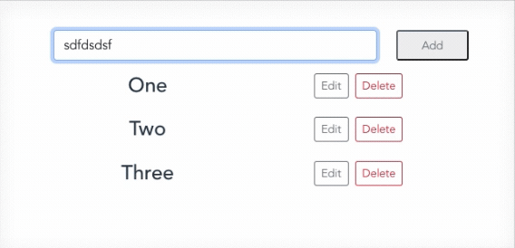

# todolist
本專案為觀摩作品，以下列出學習歷程、優化與註解
2022-06-06 第一次接觸前端框架 Vue<br>
2022-06-09 第一次接觸資料管理套件 vuex

## 作品圖片


## 功能介紹
*參考資料習得：<br>
1.新增todo<br>
2.刪除todo<br>
3.編輯todo<br>
<br>
*修改之處：<br>
1.輸入todo時，空字串不能被新增<br>
2.修改todo時，空字串不能被新增<br>

## 檔案結構
### 1.assets:
放入靜態檔案，常見是圖檔。<br>
### 2.components:
畫面要呈現且可以重複使用的元件會放在這邊，如：HTML, CSS, 簡單Javascript。<br>
通常一個一個vue裡面就放一個功能。<br>
### 3.store:
state:存放狀態值。<br>
getters:由state衍生出的狀態。<br>
actions:可以用來呼叫mutations的入口。<br>
mutations:存放函式，方便其他檔案方便存入。<br>
### 4.App.vue: 
專案的根元件，即專案本身。<br>

## Vue 學習過程：
```
<div v-bind:id="dynamicId">
```
notes:透過v-bind可以動態改變HTML的屬性，如：classList
notes: :key裡面要放的是唯一不會重複的值(id)
```
<div v-for="item in items">
  {{ item.text }}
</div>
```
notes:迭代功能
```
<MyComponent @my-event="handleThis(123, $event)" />
```
notes:類似DOM的EventListener
```
<div v-if=true>
  text
</div>
<div v-else>
  text
</div>
```
notes:if...else的寫法，記得v-else要緊鄰v-if
## 參考資料
https://vuejs.org/api/built-in-directives.html<br>
https://github.com/user97116/vue-todo-app<br>
https://github.com/cythilya/todo_list_with_vue_and_vuex<br>
https://blog.hinablue.me/2019-ithome-ironman-day-8/

## 完成日期
2022-06-11
